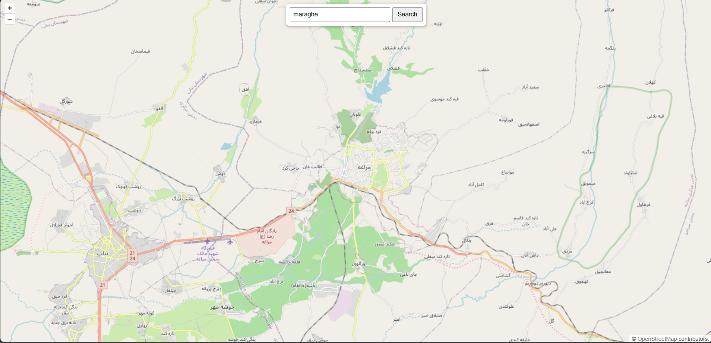
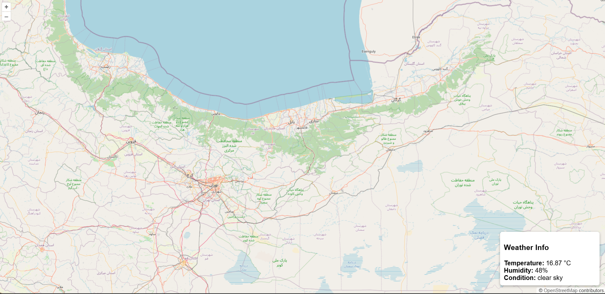

# Interactive Map with Geocoding Search & Weather Data Display

## Project Overview
This project is an interactive web map application that allows users to:
- Search for locations using a geocoding service.
- Click on the map to get weather information for any location.

The map is built using **OpenLayers**, and external APIs are used for geocoding and weather data.

---

## Table of Contents
1. [Project Structure](#project-structure)
2. [Setup Instructions](#setup-instructions)
3. [OpenLayers Features](#openlayers-features)
4. [Geocoding API](#geocoding-api)
5. [Weather API](#weather-api)
6. [API Comparisons](#api-comparisons)
7. [Screenshots / Demo](#screenshots--demo)
8. [Author](#author)

---

## Project Structure

| File Name         | Description                                                                 |
|------------------|-----------------------------------------------------------------------------|
| `index.html`      | Main HTML page containing map container and UI elements                    |
| `style.css`       | CSS file for page and map styling                                           |
| `script.js`       | JavaScript logic for OpenLayers map, geocoding search, and weather display |
| `config.js`       | Stores API keys (excluded from version control)                             |
| `ASSIGNMENT_README.md` | Original assignment instructions, renamed                                 |

---

## Setup Instructions

1. Fork this repository to your GitHub account.
2. Clone your forked repository to your local machine.
3. Rename the original `README.md` to `ASSIGNMENT_README.md`.
4. Create a `config.js` file (not committed) with your API keys:

```javascript
// config.js
const GEOCODING_API_KEY = 'YOUR_GEOCODING_API_KEY';
const WEATHER_API_KEY   = 'YOUR_WEATHER_API_KEY';
````

5. Open `index.html` in your browser to run the project.

**Note:** API keys are not included in the repository for security reasons.

---

## OpenLayers Features Used

* **Map Initialization:** Base layer using OpenStreetMap (`ol.layer.Tile`)
* **View:** Set center coordinates and initial zoom (`ol.View`)
* **Map Interaction:** Click event listener to detect clicked coordinates
* **Animation:** Smooth zoom and pan to searched locations using `map.getView().animate()`
* **Overlay/DOM:** Display weather information in a floating div on the map

---

## Geocoding API

For this project, **LocationIQ** is used as the geocoding API.

* **Functionality:** Converts a location name to latitude and longitude
* **API Endpoint:** `https://us1.locationiq.com/v1/search.php`
* **Request:** `key`, `q` (query string), `format=json`
* **Integration:** Uses fetch API to request geocoding data and animate map to result

### Example Usage

```javascript
fetch(`https://us1.locationiq.com/v1/search.php?key=${GEOCODING_API_KEY}&q=${encodeURIComponent(query)}&format=json`)
  .then(response => response.json())
  .then(data => { 
      const { lat, lon } = data[0];
      map.getView().animate({ center: ol.proj.fromLonLat([parseFloat(lon), parseFloat(lat)]), zoom: 12 });
  });
```

---

## Weather API

**OpenWeatherMap** is used to fetch weather data.

* **Functionality:** Returns temperature, humidity, and weather conditions for clicked map coordinates
* **API Endpoint:** `https://api.openweathermap.org/data/2.5/weather`
* **Request:** `lat`, `lon`, `units=metric`, `appid` (API key)
* **Integration:** On map click, fetch weather data and display it in a floating div

### Example Usage

```javascript
fetch(`https://api.openweathermap.org/data/2.5/weather?lat=${lat}&lon=${lon}&units=metric&appid=${WEATHER_API_KEY}`)
  .then(response => response.json())
  .then(data => {
      weatherContent.innerHTML = `
          <strong>Temperature:</strong> ${data.main.temp} °C
          <strong>Humidity:</strong> ${data.main.humidity}%
          <strong>Condition:</strong> ${data.weather[0].description}
      `;
  });
```

---

## API Comparisons

### Geocoding APIs

| API          | Free Tier Limits      | Paid Plans    | Rate Limits | Notes                                 |
| ------------ | --------------------- | ------------- | ----------- | ------------------------------------- |
| LocationIQ   | 5,000 requests/month  | From $5/month | 1 req/sec   | Easy integration, good documentation  |
| OpenMapQuest | 15,000 requests/month | $99/month     | 10 req/sec  | Requires account, supports animations |
| Google Maps  | 2,500 requests/day    | Pay-as-you-go | 50 req/sec  | Powerful but cost can grow quickly    |

> **Choice Reasoning:** LocationIQ chosen due to generous free tier, low cost, and simple integration.

### Weather APIs

| API            | Free Tier Limits  | Paid Plans     | Rate Limits | Notes                             |
| -------------- | ----------------- | -------------- | ----------- | --------------------------------- |
| OpenWeatherMap | 1,000 calls/day   | From $40/month | 60 req/min  | Widely used, reliable data        |
| WeatherAPI.com | 1,000 calls/month | $10/month      | 10 req/sec  | Lightweight, simple JSON response |
| Weatherbit     | 500 calls/day     | $35/month      | 60 req/min  | High-quality forecasts            |

> **Choice Reasoning:** OpenWeatherMap selected for free tier adequacy, API reliability, and detailed weather info.

---

## Screenshots / Demo



---

## Author

* **Name:** [Morteza Rashedi]
* **Course:** Web GIS / Mapping Application Assignment

---

## Notes

* All API keys are stored in a separate `config.js` file and **not committed** to the repository.
* Regular commits with clear messages should be made during development.
* The project demonstrates usage of asynchronous operations (`fetch`), DOM updates, OpenLayers animation, and error handling.

---

```
